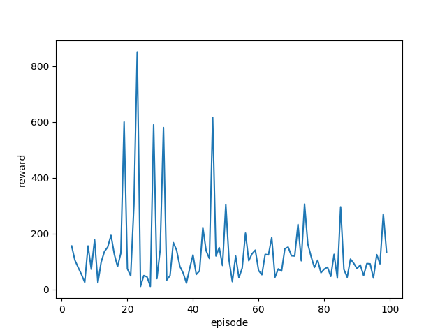

# Auto Harvest in Open-word Game Genshin Impact Report

## What's Genshin?

Genshin Impact is an action role-playing game developed and published by miHoYo. There are many ways the player may interact with the world. There are gliding, climbing, interacting with the NPCs, and fighting with minions and deities. It is an open world adventure game about the journey of the player who is trying to find his or her lost sibling. It is one of the most revenue generating mobile games in the history. It won many prices in gaming including the Nobel price in gaming – The Game Award for Best Mobile Game.

## The initiative of the project

In this game, different resources should be collected to upgrade your characters and weapons. It could be quite tedious to collect those items. Also, different kinds of resources requires different methods of collection. For the most common resources you can find them directly in the environment and press F to collet. Also shown in the video, for some resources you need to use specific skills to collect. For other resources you need to use elemental reactions to collect.

## Implementation

### version 0.0

In the first implementation, we choose our model to be DQN. We defined our environment to be the following:

- states: realtime image from the game.
- action: going forward, leftward, rightward, and downward.
- reward: inverse of the relative distance on the screen of the character with respect with the nearest target (if there is no target found, the reward is 0). [figure]

For each action, we keep pressing the relevant key for one second. After each action is applied to the environment, we always press 'F', which would harvest if there is an item at the current location and do nothing if there is no item.  

#### Problems

1. The character may enter into states that cannot be solved by the defined actions. For example, the character might encounter enemies in the environment, and can only be resolved with a fight.
1. The training process has hardly any improvement. We suspect the reason is because directly inputting the entire 1920X1080 picture into the DQN.

### version 0.1

1. To deal with the case that the character facing events that are not relevant to the scope of this project, we set a finite number of time steps. After countering undesired events, the environment would be reset after reaching the maximum time step.

1. To counter the issue that the states of the environment is too large to train, we chose to first process the high level image input into low-level data. We changed our model to be a two-stage model. The image of the game is first passed through YoloX. Then, we are able to get the low-level data:  the coordinates of the bounding box surrounding each detected object and the name of the detected object. Then, we passed the low-level data into the DQN. In this model, We defined our environment to be the following:

- states: bounding boxes and names of the detected objects.
- action: going forward, leftward, rightward, and downward.
- reward: inverse of the relative distance on the screen of the character with respect with the nearest target (if there is no target found, the reward is 0 by assuming the distance to the closest object is infinite).
- reset: when it reaches some number of steps (hyperparameter).

#### Problems

1. Sometimes the YoloX would lose trace of the character because there could be bushes that blocks the view. [figure]

1. The accuracy of YoloX is low. [figure]

1. It is common that there is no available object to be collected in the view of the character. In this case, since YoloX returns nothing except the coordinate of the character to the DQN, it is impossible for the DQN to tell which direction to go, so this would result in a random action that might keep the character to wander around the same field. [demo]

### version 0.1.1

1. When the YoloX loses trace of the character, we continue stepping forward with small steps until the character can be detected by YoloX.

1. When the view contains no object, the reward is set to 0 no matter what action is taken.

AS a result, we defined our environment to be the following:

- states: bounding boxes and names of the detected objects.
- action: going forward, leftward, rightward, and downward.
- reward: inverse of the relative distance on the screen of the character with respect with the nearest target (if there is no target found, the reward is 0 by assuming the distance to the closest object is infinite).
- reset: when it reaches some number of steps (hyperparameter).

## Results
we transfer the reward from float to int, and calculate the real item number we get by human, we run these algorithm 10 times (each time:100 episodes and each episodes with 50 timesteps-- about 1.5 hour).Here is the comparison between the comparison of the harvesting of:
|agent |avg_reward |real reward|
| ------|:---:  |  :---:   |
|random |55  |4 |
|v0.1.1|310  |10 |

And here is the reward result(one time) for our agent v0.1.1

## Discussion

### Analysis of the results

### Future improvement

1. We could expand our dataset to improve the robustness of our model.
1. Add detection of successful collection and thus achieve a better reward function. This can be done in either of the following ways:
    - Run YoloX twice in the reward function. Compare the closest objects detected. If the closest object is gone while others remains the same, we could then conclude that the object has been collected.
    - Add labeling for the character 'F' which comes out in the game when there is an item that can be collected. Thus, if we are able to detect the 'F', we could conclude that we have reach a place where an item can be collected.
1. We could add a map as a parameter to the environment. The environment actually are not always the same. Items that we harvested would regenerate after a fixed amount of time. Adding a map would enable the model to keep track of the places that has been visited. Then, we could use a function that reduces the curiosity towards the explored area and increased area, and further decrease the curiosity whether items has been collected.
1. Add a detection of special events that might come out during harvesting, such as encountering enemies or the action leads to climbing, which would make the actions different.
