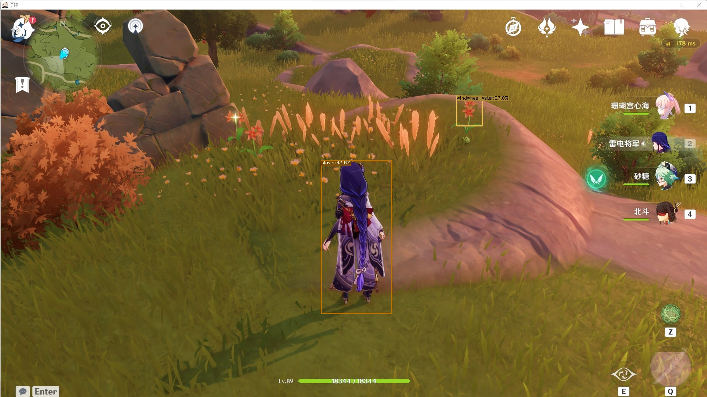

# Introduction
genshin automatic harvesting AI is composed of [YOLOX](https://github.com/Megvii-BaseDetection/YOLOX), DQN two-part model. Use transfer learning, semi-supervised learning for training.We use yolox to detect the pixel coordinates of characters and items in the picture, and convert this information into our custom state information, and use DQN to make decisions.

our video demo: [demo](https://www.bilibili.com/video/BV1Kb4y1v7Zx?spm_id_from=333.999.0.0)


# Install
Install [anaconda](https://www.anaconda.com/products/individual#Downloads), configure the virtual environment

## Download our project
```shell
git clone https://github.com/ruoyuGao/Genshin_auto_harvesting.git
```
## Environment configuration
```shell
conda env create -f environment.yaml
```
we use pytorch 1.7.0 with cuda 11.0.If the above commands don’t work well, you can try to install them manually by yourself.
## Install yolox
```shell
python setup.py develop
```

## Download Pre-training weight 
Down load the weights for transfer learning. we use yolox_s here.[weights](https://github.com/Megvii-BaseDetection/YOLOX/releases/download/0.1.1rc0/yolox_s.pth)
Then  put the file under the weights folder.

# Training process for YOLOX

```shell
python .tools\train.py image -n yolox-s -f .\exps\example\yolox_voc\yolox_voc_s.py -c .\YOLOX_outputs\yolox_voc_s\latest_ckpt.pth --conf 0.25 --nms 0.45 --tsize 640 --device gpu 
```

# Traing process for DQN
Before training, you need to open the genshin impact and Teleport your agent to the statue of the seven closest to the Dawn winery. Then start training.
```shell
 python .\tools\train_harvest.py image -n yolox-s -f .\exps\example\yolox_voc\yolox_voc_s.py -c .\YOLOX_outputs\yolox_voc_s\latest_ckpt.pth --conf 0.25 --nms 0.45 --tsize 640 --device gpu 
```

# Running our agent
The command line window must be started with <font color=#66CCFF>**Administrator authority**</font>

Running on gpu
```shell
python .\tools\harvesting.py image -n yolox-s -f .\exps\example\yolox_voc\yolox_voc_s.py -c .\YOLOX_outputs\yolox_voc_s\latest_ckpt.pth --conf 0.25 --nms 0.45 --tsize 640 --device gpu 
```
Running on cpu
```shell
python .\tools\harvesting.py image -n yolox-s -f .\exps\example\yolox_voc\yolox_voc_s.py -c .\YOLOX_outputs\yolox_voc_s\latest_ckpt.pth --conf 0.25 --nms 0.45 --tsize 640 --device gpu 
```
When you see, every thing is ok, press r to start the agent

# Version history
We plan to update this project for a long time. The ultimate goal is to successfully collect various types of objects on different terrains.

## v0.2(Comming soon)

 - [ ] add new actions in our environment files(fly and attack)
 - [ ] Add a curiosity auxiliary map to help the agent explore
 - [ ] collect more data to Improve detection accuracy
 - [ ] try to find more efficent algorithm to upgrade our agent

## v0.1
 - achieved the harvesting function of agents in the Mond Plain(we desigend all the basic setting that our agent can work on it now)
 - Implemented an interface that can be used to capture human behavior

# Our report
[Report](https://github.com/ruoyuGao/Genshin_auto_harvesting/blob/main/Blog.md)
